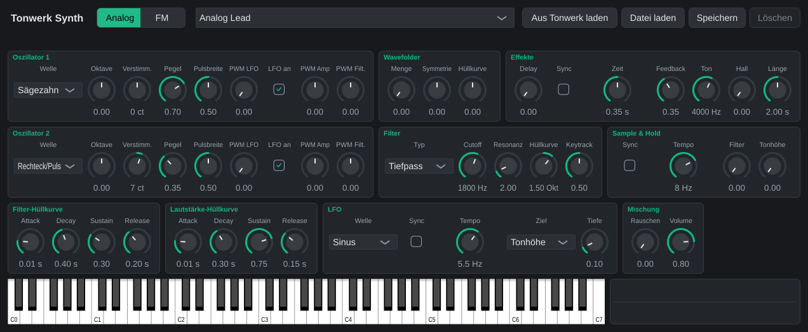
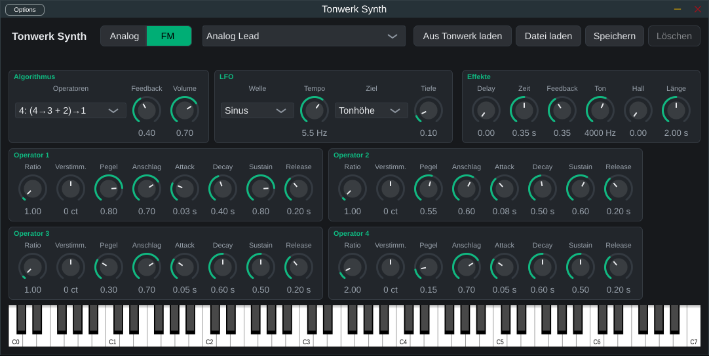

# Tonwerk Synth

Die beiden Browser-Synthesizer aus Tonwerk (YuE UI) als Plugin für Logic Pro: ein Instrument mit einer **Analog**- und einer **FM**-Engine, dazu Delay und Hall. Klänge, die in Tonwerk auf der Instrumente-Seite gespeichert sind, lassen sich übernehmen und klingen hier wie dort.

Logic lädt nur Audio Units, deshalb wird das Plugin als **Audio Unit** gebaut, dazu als VST3 (für andere Hosts) und als eigenständige App zum Ausprobieren ohne Logic.





## Was drin ist

**Analog**: zwei Oszillatoren (Sinus, Dreieck, Sägezahn, Rechteck/Puls) mit Oktave, Verstimmung und Pegel, Rauschen, Filter (Tiefpass, Hochpass, Bandpass) mit Resonanz, Keytracking und eigener Hüllkurve, Lautstärke-Hüllkurve, LFO auf Tonhöhe, Filter oder Lautstärke, frei oder im Songtempo. Der Puls hat eine Pulsbreite, die der LFO und beide Hüllkurven bewegen können (PWM).

**Wavefolder und Sample & Hold** gibt es nur im Plugin, nicht in Tonwerk. Der Wavefolder sitzt zwischen Oszillatoren und Filter. **Menge** treibt die Mischung bis zum Achtfachen und faltet alles über dem Vollpegel zurück, statt es abzuschneiden. **Symmetrie** verschiebt das Signal vor dem Falten, das bringt geradzahlige Obertöne. Mit **Hüllkurve** öffnet und schließt die Filter-Hüllkurve den Wavefolder. Sample & Hold nimmt in jedem Schritt einen neuen Zufallswert und hält ihn bis zum nächsten. **Filter** verschiebt damit den Cutoff um bis zu zwei Oktaven nach oben oder unten, **Tonhöhe** den Ton um bis zu eine Oktave. Das Tempo ist frei oder im Songtempo, und jede Note würfelt ihre eigene Folge. Beide stehen auf 0, solange du sie nicht aufdrehst, und Klänge aus Tonwerk laden mit beiden aus.

**FM**: vier Sinus-Operatoren wie beim Yamaha TX81Z, dessen acht Algorithmen, Feedback auf Operator 4, eine Hüllkurve pro Operator, Anschlagsdynamik pro Operator, LFO auf Tonhöhe, Modulationsindex oder Lautstärke, frei oder im Songtempo.

**Effekte**: Delay mit Tiefpass in der Rückkopplung und Hall, beide als Send. Das Delay läuft frei oder im Songtempo.

**Tempo-Sync**: Mit **Sync** folgen LFO, Sample & Hold und Delay dem Tempo von Logic. Statt Hz oder Sekunden wählst du einen Notenwert von 4/1 bis 1/32, auch punktiert und triolisch. Ohne Host-Tempo (in der App) gelten 120 BPM. Der LFO beginnt wie in Tonwerk mit jeder Note neu. Er läuft also im Tempo, aber nicht auf den Schlag genau.

**Oszilloskop**: unten rechts neben der Tastatur. Es zeigt die Wellenform dessen, was das Plugin gerade spielt, und steht bei einem gehaltenen Ton still.

16 Stimmen, Pitchbend ±2 Halbtöne, Sustain-Pedal. Jeder Regler ist ein Parameter, den Logic automatisieren kann und mit dem Projekt speichert. Eine Tastatur unten im Fenster spielt das Plugin auch ohne MIDI-Keyboard an.

## Herunterladen

Unter [Releases](https://github.com/Marcel-B/Synth/releases) liegt zu jeder Version ein Zip mit Audio Unit, VST3, App und Installationsskript, für Apple Silicon und Intel ab macOS 11. Nach dem Laden im Terminal:

```sh
cd ~/Downloads/Tonwerk-Synth-*-macOS
zsh install.sh
```

Die Plugins sind nur ad hoc signiert, denn eine Signatur mit Apple Developer ID kostet ein Entwicklerkonto. Deshalb versieht macOS alles aus dem Netz mit einer Quarantäne-Markierung, und Logic lädt so markierte Plugins nicht. `install.sh` entfernt die Markierung (`xattr -dr com.apple.quarantine`), kopiert die Dateien an ihren Platz und prüft die Audio Unit mit `auval`. Wer lieber von Hand installiert, ruft vorher selbst `xattr -dr com.apple.quarantine` auf den entpackten Ordner auf.

Zum Aktualisieren lädst du das neue Zip und rufst dessen `install.sh` genauso auf. Logic sollte dabei geschlossen sein. Importierte Klänge bleiben erhalten, und gespeicherte Projekte laden ihre Einstellungen weiter.

Ein neues Release entsteht, wenn ein Tag wie `v0.2.0` gepusht wird, oder von Hand unter Actions → Release → „Run workflow“ mit einer Versionsnummer. Die Action `release.yml` baut dann, testet, prüft mit `auval` und hängt das Zip an. Die Versionsnummer des Plugins kommt aus dem Tag, so erkennt Logic eine neue Version.

## Selbst bauen auf dem Mac

Ein volles Xcode ist nicht nötig, die Command Line Tools reichen:

```sh
xcode-select --install          # einmal, falls noch nicht da
brew install cmake              # einmal
git clone https://github.com/Marcel-B/Synth.git && cd Synth
scripts/install-macos.sh
```

Das Skript baut eine Universal-Binary (Apple Silicon und Intel), signiert sie ad hoc, kopiert die Audio Unit nach `~/Library/Audio/Plug-Ins/Components`, das VST3 nach `~/Library/Audio/Plug-Ins/VST3` und die App nach `~/Applications`, und prüft die Audio Unit mit Apples `auval`. Der erste Lauf lädt JUCE herunter und dauert ein paar Minuten.

In Logic: neue Software-Instrument-Spur, im Kanalzug **Instrument → AU-Instrumente → b-velop → Tonwerk Synth**. Taucht es nicht auf, im Plug-in-Manager (Logic Pro → Einstellungen → Plug-in-Manager) „Tonwerk Synth" suchen und **Erneut scannen** wählen.

Entfernen: `scripts/install-macos.sh --uninstall`.

Zwischenstände ohne Release: Jeder Lauf der Action `build.yml` legt die Dateien auch als Artefakt `tonwerk-synth-macos` ab (Actions → Lauf → Artifacts). Für sie gilt dasselbe wie für Releases, die Quarantäne-Markierung muss weg.

## Klänge aus Tonwerk

Das Menü oben listet die **Werksklänge** (Tonwerks Startklänge pro Spurart, für beide Engines) und die übernommenen Klänge.

- **Aus Tonwerk laden** fragt nach Tonwerks Adresse, so wie sie im Browser steht (z. B. `https://<mac>.<tailnet>.ts.net:8443`), und übernimmt alle dort gespeicherten Klänge. Die Adresse wird gemerkt. Gleichnamige Klänge werden ersetzt, ein zweiter Abruf bringt die Liste also auf den Stand von Tonwerk.
- **Datei laden** liest eine JSON-Datei: einen Klang, wie ihn **Speichern** schreibt (`{ "name", "patch" }`), Tonwerks ganze Liste (die Antwort von `GET /api/logic/synths/presets`) oder einen nackten Patch.
- **Speichern** schreibt den aktuellen Klang als JSON im Format von Tonwerk.
- **Löschen** entfernt einen übernommenen Klang aus der Liste des Plugins, in Tonwerk bleibt er.

Die übernommenen Klänge liegen in `~/Library/Application Support/Tonwerk Synth/presets.json` und stehen in jedem Projekt zur Verfügung. Was ein Logic-Projekt spielt, speichert Logic mit dem Projekt; ein späterer Abruf aus Tonwerk ändert es nicht.

## Wie nah am Browser

Die Klangerzeugung rechnet nach, was Tonwerks Web-Audio-Graph tut: dieselben Wellenformen und Pegel (der Puls mit PWM ist dort halb so laut wie das reine Rechteck, hier auch), Web Audios Biquad-Filter mit seiner Eigenheit, dass die Resonanz bei Tief- und Hochpass in Dezibel angegeben ist, dieselbe Hüllkurvenform (linearer Anstieg, exponentieller Abfall mit Zeitkonstante Decay/4), FM als Frequenzmodulation in Hz mit Index bis 8, Feedback nach DX-Art, der Hall aus abklingendem Rauschen bei 0,15. Unterschiede:

- Regler wirken sofort auf klingende Noten, im Browser erst auf die nächste.
- Nach dem Release wird die Stimme in 3 ms ausgeblendet statt hart abgeschnitten.
- Die Oszillatoren sind mit PolyBLEP bandbegrenzt, Web Audio rechnet die Wellen anders; im Klang sollte das nicht auffallen, in den höchsten Lagen vielleicht ein wenig.
- Wavefolder und Sample & Hold hat nur das Plugin. Der Wavefolder rechnet mit einfacher zweifacher Überabtastung, bei hohen Tönen und viel Menge kann er trotzdem etwas Aliasing erzeugen.

**Getestet und ungetestet:** Das Plugin wurde unter Linux gebaut und getestet (Klangerzeugung, Presets, Parameter, Zustand) und die Oberfläche dort angesehen. `auval` läuft in der GitHub Action auf einem Mac. Version 0.2.0 läuft in Logic auf deinem MacBook. Wavefolder und Sample & Hold (ab 0.3.0) sind dort noch nicht gehört. Ob es genau wie der Browser klingt, ist nur mit den Ohren zu prüfen.

## Entwickeln

```sh
cmake -S . -B build -DCMAKE_BUILD_TYPE=Debug
cmake --build build --target TonwerkSynthTests && ctest --test-dir build --output-on-failure
cmake --build build --target TonwerkSynth_Standalone   # die App zum Ausprobieren
```

Unter Linux braucht JUCE ein paar Pakete, siehe `.github/workflows/build.yml`. Dort entstehen VST3 und App, die Audio Unit nur auf dem Mac.

## Lizenz

Das Plugin nutzt [JUCE](https://juce.com) 8, das unter AGPLv3 oder einer kommerziellen Lizenz steht. Für den eigenen Gebrauch genügt das; wer das Plugin weitergeben will, muss sich vorher für eine der beiden Lizenzen entscheiden.
