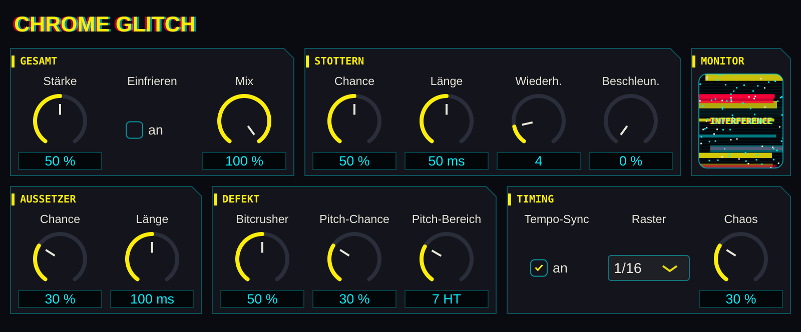
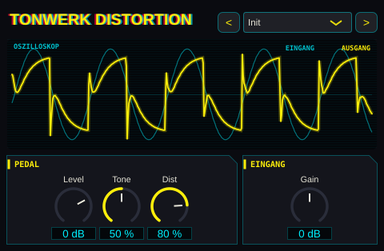
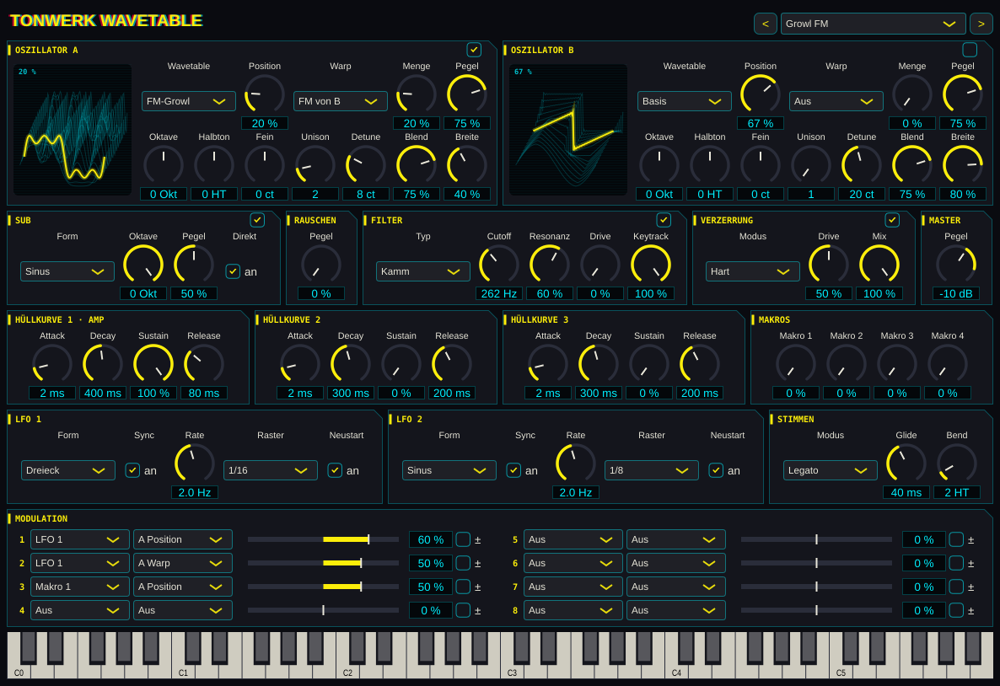
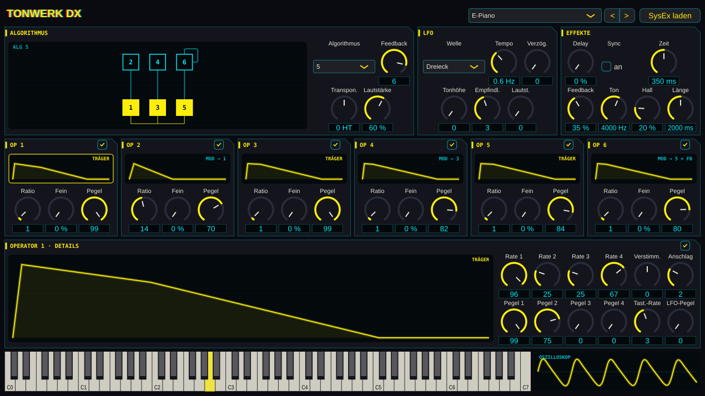
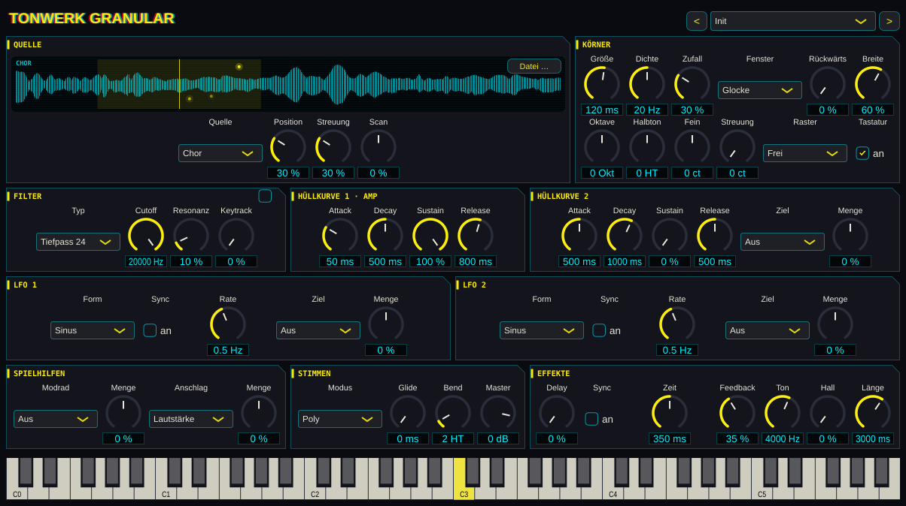
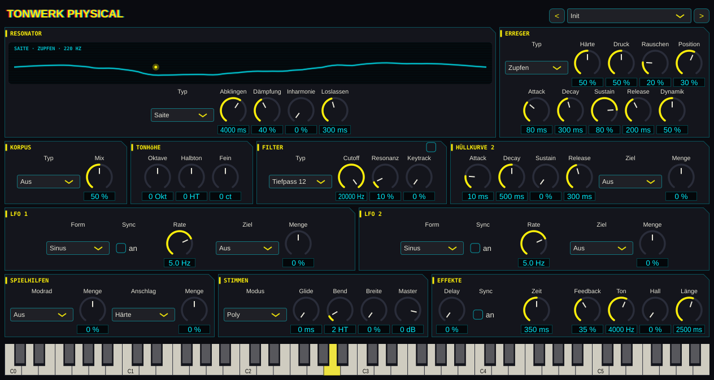
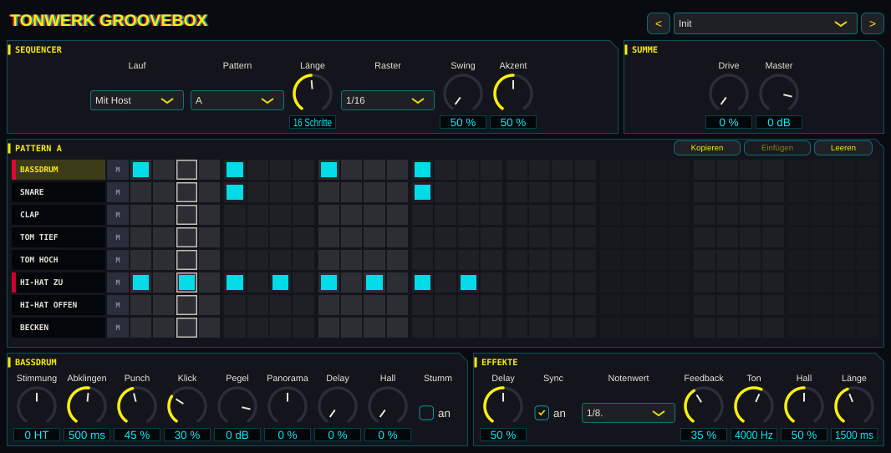

# Tonwerk Synth

Die beiden Browser-Synthesizer aus Tonwerk (YuE UI) als Plugins für Logic Pro: **Tonwerk Analog** und **Tonwerk FM**, jeder mit Delay und Hall und eigenen Werksklängen. Dazu kommen **Tonwerk DX** mit sechs Operatoren für den klassischen FM-Klang der Achtziger, der Wavetable-Synthesizer **Tonwerk Wavetable** für Dubstep-Bässe, der Granular-Synthesizer **Tonwerk Granular** für Klangwolken, **Tonwerk Physical**, der gezupfte, gestrichene, geblasene und angeschlagene Instrumente aus ihrer Physik nachrechnet, die Drum-Machine **Tonwerk Groovebox** mit Step-Sequencer, die Effekte **Chrome Glitch** für zerstückelte Gesangsspuren und **Tonwerk Distortion**, ein klassischer Gitarren-Verzerrer (siehe unten). Klänge, die in Tonwerk auf der Instrumente-Seite gespeichert sind, lassen sich übernehmen und klingen hier wie dort.

Logic lädt nur Audio Units, deshalb wird das Plugin als **Audio Unit** gebaut, dazu als VST3 (für andere Hosts) und als eigenständige App zum Ausprobieren ohne Logic.


## Zwei Plugins statt einem

Bis 0.3.0 waren beide Engines ein Plugin, **Tonwerk Synth**, mit einem Umschalter oben. Jetzt ist jede Engine ein eigenes Instrument: **Tonwerk Analog** (`aumu TwAn Bvlp`) und **Tonwerk FM** (`aumu TwFm Bvlp`). Jedes hat nur seine eigenen Regler (Logic zeigt bei der Automation also keine fremden mehr) und seine eigenen Werksklänge (siehe [Werksklänge](#werksklänge)).

Die aus Tonwerk oder Dateien übernommenen Klänge teilen sich beide Plugins (dieselbe `presets.json`); jedes zeigt im Menü nur die seiner Engine. Lädst du in Tonwerk Analog eine Datei mit FM-Klängen, landen sie im Menü von Tonwerk FM.

**Alte Projekte:** Tonwerk Synth bleibt installiert und lädt seine Projekte wie bisher, mit beiden Engines und den acht alten Werksklängen auf denselben Programmnummern (die neuen hängen dahinter). Es hat ebenfalls die neue Oberfläche. Für neue Spuren nimmst du Tonwerk Analog oder Tonwerk FM. Eine alte Spur ziehst du um, indem du in Tonwerk Synth **Speichern** drückst und die Datei im neuen Plugin mit **Datei laden** öffnest.

**Oberfläche:** alle Tonwerk-Plugins sehen jetzt aus wie Tonwerk Wavetable: fast schwarz, Gelb, Cyan und Rot im Neon-Look, Paneele mit abgeschnittener Ecke, Bildschirme mit Scanlines. Jede Hüllkurve zeigt ihre Form, Tonwerk FM zeichnet den gewählten Algorithmus (Träger gelb, Modulatoren cyan, die Rückkopplung an Operator 4) und schreibt über jede Operator-Hüllkurve, was der Operator gerade tut („TRÄGER“, „MOD → 1“). Werte stehen als ganze Zahlen mit Einheit da: Zeiten in ms, Pegel und Mengen in %, die Filter-Hüllkurve in Halbtönen (HT), langsame LFO-Raten mit einer Nachkommastelle.

## Was drin ist

**Analog**: zwei Oszillatoren (Sinus, Dreieck, Sägezahn, Rechteck/Puls) mit Oktave, Verstimmung und Pegel, Rauschen, Filter (Tiefpass, Hochpass, Bandpass) mit Resonanz, Keytracking und eigener Hüllkurve, Lautstärke-Hüllkurve, LFO auf Tonhöhe, Filter oder Lautstärke, frei oder im Songtempo. Der Puls hat eine Pulsbreite, die der LFO und beide Hüllkurven bewegen können (PWM).

**Wavefolder und Sample & Hold** gibt es nur im Plugin, nicht in Tonwerk. Der Wavefolder sitzt zwischen Oszillatoren und Filter. **Menge** treibt die Mischung bis zum Achtfachen und faltet alles über dem Vollpegel zurück, statt es abzuschneiden. **Symmetrie** verschiebt das Signal vor dem Falten, das bringt geradzahlige Obertöne. Mit **Hüllkurve** öffnet und schließt die Filter-Hüllkurve den Wavefolder. Sample & Hold nimmt in jedem Schritt einen neuen Zufallswert und hält ihn bis zum nächsten. **Filter** verschiebt damit den Cutoff um bis zu zwei Oktaven nach oben oder unten, **Tonhöhe** den Ton um bis zu eine Oktave. Das Tempo ist frei oder im Songtempo, und jede Note würfelt ihre eigene Folge. Beide stehen auf 0, solange du sie nicht aufdrehst, und Klänge aus Tonwerk laden mit beiden aus.

**FM**: vier Sinus-Operatoren in acht Algorithmen wie bei den 4-Operator-FM-Synths der Achtziger, Feedback auf Operator 4, eine Hüllkurve pro Operator, Anschlagsdynamik pro Operator, LFO auf Tonhöhe, Modulationsindex oder Lautstärke, frei oder im Songtempo.

**Effekte**: Delay mit Tiefpass in der Rückkopplung und Hall, beide als Send. Das Delay läuft frei oder im Songtempo.

**Tempo-Sync**: Mit **Sync** folgen LFO, Sample & Hold und Delay dem Tempo von Logic. Statt Hz oder Sekunden wählst du einen Notenwert von 4/1 bis 1/32, auch punktiert und triolisch. Ohne Host-Tempo (in der App) gelten 120 BPM. Der LFO beginnt wie in Tonwerk mit jeder Note neu. Er läuft also im Tempo, aber nicht auf den Schlag genau.

**Oszilloskop**: unten rechts neben der Tastatur, in beiden Plugins. Es zeigt die Wellenform dessen, was das Plugin gerade spielt, und steht bei einem gehaltenen Ton still.

16 Stimmen, Pitchbend ±2 Halbtöne, Sustain-Pedal. Jeder Regler ist ein Parameter, den Logic automatisieren kann und mit dem Projekt speichert. Eine Tastatur unten im Fenster spielt das Plugin auch ohne MIDI-Keyboard an.

## Chrome Glitch (Effekt)

Ein Audio-Effekt aus demselben Repository, für eine Gesangsspur, deren „Sprach-Chrome“ versagt: Silben stottern („bo-bo-body“), die Stimme setzt kurz aus, wird digital zerbröselt und springt in der Tonhöhe. Er liegt in Logic unter **Audio-FX → Audio Units → b-velop → Chrome Glitch** und wird mit Tonwerk Synth zusammen gebaut, installiert und veröffentlicht.



Oben rechts sitzt ein kleiner **Monitor**: Solange die Stimme sauber ist, zeigt er „CHROME OK“. Bei jedem Glitch flimmert er mit zerrissenen Balken und Rauschen und zeigt „INTERFERENCE“ (Stottern), „NO SIGNAL“ (Aussetzer) oder „FROZEN“ (Einfrieren). Die Texte im Monitor sind bewusst englisch, wie die Anzeigen im Spiel. Auch Glitches, die kürzer als ein Bild sind, lassen ihn aufflackern.

Der Effekt arbeitet ohne Latenz auf dem, was gerade hereinkommt. An jedem Schritt des Rasters (im Songtempo) oder zu zufälligen Momenten (40–250 ms auseinander) würfelt er, ob etwas passiert:

- **Stottern**: Die letzten 10–200 ms (Standard 50 ms) werden mehrmals wiederholt. **Beschleunigen** macht jede Wiederholung kürzer, so wird die Silbe immer schneller. Ab der zweiten Wiederholung kann die Tonhöhe springen (**Pitch-Chance**, **Pitch-Bereich** bis ±24 Halbtöne).
- **Aussetzer**: Die Stimme fällt 20–300 ms ganz weg.
- **Bitcrusher**: Bei jedem Glitch voll (bis 4 Bit und 16-faches Downsampling), dazwischen nur leicht, mit der Stärke wachsend.
- **Einfrieren**: Hält die letzte Silbe in einer Schleife fest, solange es an ist. Für das letzte Wort, das hängen bleibt.
- **Tempo-Sync** und **Raster** (1/8, 1/16, 1/32) legen die Glitches aufs Raster. **Chaos** streut zusätzlich Glitches zwischen die Rasterpunkte und lässt die Stotterlänge schwanken, damit es nicht wie ein sauberer Stutter-Effekt klingt.
- **Glitch-Stärke** ist das Makro für die Automation: Auf 0 geht die Stimme unverändert durch, nach oben werden alle Chancen und der Crusher stärker. Für den letzten Chorus also die Stärke über die vier Zeilen hochziehen und am Ende **Einfrieren** einschalten. Die absolute Stille danach entsteht am einfachsten mit einem Schnitt in der Region.

Alle Übergänge werden über 1,5 ms überblendet, es knackt also nur, wo es soll.

**Seed** (0–999) macht die Glitches wiederholbar: Während Logic spielt, wird an jedem Schlag neu gewürfelt, aus dem Seed und der Nummer des Schlags. Ein Glitch gehört damit zu seiner Stelle im Song. Mit demselben Seed klingt der Chorus gleich, egal ob die Wiedergabe dort startet, am Anfang oder ob der ganze Song gebounct wird (ab dem ersten vollen Schlag nach dem Start; ein Stotterer braucht etwa 200 ms Vorlauf, weil er wiederholt, was davor lief). Passt eine Stelle nicht, gibt ein anderer Seed eine andere, wieder feste Folge. Der Seed lässt sich automatisieren, etwa ein Wert für den Chorus und ein anderer für die Bridge. Ohne laufenden Transport bleibt es zufällig.

**Presets** (Logics Programme, oben rechts im Menü und mit den Pfeilen): 13 Einstellungen in vier Gruppen, von **Dezent** (Leichtes Flackern, Wackelkontakt, Funkloch) über **Rhythmisch** (Achtel-Stotter, Sechzehntel-Roll, Stotter-Rampe, Zerhacker) und **Zerstört** (Kernschmelze, Cyberpsychose, Systemabsturz) bis **Klangeffekte** (Roboterstimme, Tonhöhen-Sprünge, Geisterecho mit 50 % Mix). Ein Preset setzt alle Regler, die es nicht nennt, auf ihren Standard zurück; Einfrieren und Seed bleiben also aus bzw. auf 0. Im Test bringt jedes auf einer Stimme in vier Takten Glitches, wird nicht lauter als die Stimme und höchstens 3 dB leiser (Aussetzer nehmen etwas weg).

**Getestet und ungetestet:** Unter Linux gebaut und getestet (Durchreichen bei Stärke 0, Stotterperiode, klickfreie Aussetzer und Tonhöhensprünge, Raster im Sync, Einfrieren, Crusher, Seed und Songposition, Zustand, Presets). `auval` für den Effekt läuft in der GitHub Action. In Logic ist er noch nicht gehört, die Presets nur auf einer künstlichen Stimme aus dem Test.

## Tonwerk Distortion (Effekt)

Der dritte Baustein aus diesem Repository: die Schaltung eines klassischen Verzerrer-Pedals, Stufe für Stufe nachgerechnet. Er liegt in Logic unter **Audio-FX → Audio Units → b-velop → Tonwerk Distortion** und wird mit den anderen beiden gebaut, installiert und veröffentlicht.



Oben zeigt ein Oszilloskop den Ausgang (gelb) über dem Eingang (cyan); so siehst du, wie Dist die Welle eckig macht. Die Regler sind die des Pedals, in derselben Reihenfolge:

- **Level**: die Lautstärke danach, −30 bis +12 dB. Bei 0 dB liegt eine voll verzerrte Note bei Tone in der Mitte um −6 dBFS.
- **Tone**: 0 % dunkel, 100 % hell. In der Mitte entsteht die typische Delle um 500 Hz (etwa 8 dB unter Bässen und Höhen), die das Pedal nach „Wand“ klingen lässt.
- **Dist**: 0 bis 100 %, wie das 100-kΩ-Poti im Pedal (Verstärkung der Op-Amp-Stufe 1- bis 22-fach). Auch auf 0 % zerrt das Pedal schon etwas, das macht der Transistor-Booster davor.
- **Eingang** gibt es am Pedal nicht: −24 bis +24 dB vor der Schaltung. Gerechnet wird mit 1,0 im Host = 1 V an der Eingangsbuchse, also etwa einer kräftig angeschlagenen Gitarre. Eine leise aufgenommene Gitarre oder ein Synth verzerrt mit mehr Eingang so, wie man es vom Pedal kennt.

Was nachgebildet ist: Transistor-Booster (35 dB, Hochpass 33 Hz, weich in die Versorgung), Op-Amp-Stufe mit Dist-Poti, 72-Hz-Bassbeschnitt über C8 und 100 pF gegen das Zischeln, Rails eines 9-V-Single-Supply-Op-Amps (asymmetrisch, das gibt geradzahlige Obertöne), dann der Tiefpass 7,2 kHz und die zwei 1N4148 gegen Masse, aus der Shockley-Gleichung als Tabelle. Das ist das harte Clipping um ±0,6 V, das diesen Verzerrer von weicheren Overdrive-Pedalen unterscheidet. Danach die Tone-Blende aus Tiefpass 234 Hz und Hochpass 1063 Hz. Die Bauteilwerte stammen aus einer veröffentlichten Analyse der Originalschaltung. Weggelassen ist die Slew-Rate des Op-Amps: Der 7,2-kHz-Tiefpass verdeckt sie, und digital kostet sie mehr Aliasing, als sie bringt.

**CPU:** Die verzerrenden Stufen laufen vierfach überabgetastet, die Clipper zusätzlich mit Antiderivative-Antialiasing; was zurückfaltet, bleibt selbst bei einer 2,5-kHz-Note mit voller Verzerrung mehr als 60 dB unter dem Ton. Tone und Level laufen auf der normalen Rate. Stereo rechnet das Plugin im Test etwa 50-mal schneller als Echtzeit (rund 2 % eines Kerns), auf einer Mono-Spur nur einen Kanal, also die Hälfte. Die Überabtastung bringt eine Latenz von wenigen Samples, die das Plugin Logic meldet.

**Presets** (oben rechts im Menü und mit den Pfeilen): 16 Einstellungen, nach der Quelle sortiert. **Gitarre**: Leicht angezerrt, Crunch, Rock-Rhythmus, Blues-Solo, Solo-Lead, Metal, Fuzz-Wand. **Bass**: Bass-Knurren, Bass-Fuzz (Tone dunkel, sonst bleibt vom Bass wenig übrig). **Synths**: Synth-Wärme, Acid-Biss, Lo-Fi-Lead. **Drums**: Drum-Dreck, Zertrümmert. **Gesang**: Megafon, Schrei. Jedes Preset ist so eingepegelt, dass es etwa so laut ist wie die Spur ohne Effekt, wenn sie mit Spitzen um −6 dBFS aufgenommen ist (im Test höchstens 2 dB daneben, gemessen nach EBU R128). Ein- und Ausschalten springt dann kaum in der Lautstärke. Ist deine Spur deutlich leiser oder lauter, passt du den Eingang an.

**Getestet und ungetestet:** Unter Linux gebaut und getestet (Diodenkennlinie, Tone-Delle, Obertöne mit Dist, Pegel, Aliasing, Stille nach dem Ton, Mono und Stereo, Zustand, Anzeige in ganzen Zahlen, Pegel der Presets) und die Oberfläche dort angesehen. Die Presets sind auf künstlichen Testsignalen (gezupfte Saiten, Sägezahn, Drumloop, Vokale) eingestellt, nicht auf echten Aufnahmen. `auval` läuft in der GitHub Action. In Logic ist er noch nicht gehört, und ob er wie das Pedal in deinem Kopf klingt, entscheiden die Ohren.

## Tonwerk Wavetable (Instrument)

Ein Wavetable-Synthesizer für Dubstep-Bässe (Wobble, Growl, Reese, Riddim), Screeches, Laser und breite Leads. Alles ist eigener Code, auch die Wavetables: Sie werden beim Laden aus Formeln berechnet, nichts ist aus einem anderen Synth kopiert. Er liegt in Logic unter **Instrument → AU-Instrumente → b-velop → Tonwerk Wavetable** und wird mit den anderen Plugins gebaut, installiert und veröffentlicht.



- **Zwei Wavetable-Oszillatoren (A und B)** mit je 64 Frames. **Position** fährt durch die Frames, die Anzeige links zeigt die Tabelle als gestapelte Frames und folgt beim Spielen der modulierten Position. Die Tabellen: *Basis* (Sinus → Dreieck → Säge → Rechteck), *Sync*, *PWM*, *Vokal* (Formanten a-e-i-o-u, der „Yoi“-Growl), *FM-Growl*, *Falter*, *Harmonisch*, *Kamm*, *Bitcrush*, *Rauh*.
- **Warp** verbiegt die Phase vor dem Lesen: *Sync*, *Bend*, *PWM* und *FM* (A von B, B von A). Für FM muss der andere Oszillator nicht hörbar sein, er läuft als Modulator auch ausgeschaltet mit.
- **Unison** bis 8 Stimmen pro Oszillator mit **Detune** (Cent zwischen den äußeren Stimmen), **Blend** (wie laut die äußeren Stimmen sind) und **Breite** im Stereobild. Der Pegel bleibt beim Hinzufügen von Stimmen gleich.
- **Sub** (Sinus, Dreieck, Säge, Rechteck, 0 bis −3 Oktaven) und **Rauschen**. Sub *Direkt* führt den Sub am Filter vorbei, damit das Fundament sauber bleibt, während der Filter wobbelt.
- **Filter**: Tiefpass 12 und 24 dB, Hochpass, Bandpass, Kerbfilter und **Kamm** (auf die Cutoff-Frequenz gestimmt, mit Keytracking 100 % auf die Note: metallische Growls). **Drive** sättigt vor dem Filter.
- **Drei Hüllkurven** (1 ist die Lautstärke) und **zwei LFOs** (Sinus, Dreieck, Säge ab/auf, Rechteck, Zufall). Mit **Sync** läuft ein LFO im Raster des Songtempos, von 4/1 bis 1/32 mit punktierten und Triolen. Mit **Neustart** beginnt er bei jeder Note von vorn (der klassische Wobble beim Spielen); ohne läuft er durch und rastet, solange Logic spielt, auf die Songposition ein, sodass der Wobble immer auf dem Beat liegt.
- **Modulation**: acht Zeilen aus Quelle, Ziel und Menge (−100 bis 100 %). Quellen: LFOs, Hüllkurven, Anschlag, Modrad, Aftertouch, Tonhöhe und **vier Makros** (gut zum Automatisieren in Logic). Ziele: Position, Warp, Tonhöhe (100 % = 24 Halbtöne), Pegel und Detune beider Oszillatoren, Sub, Rauschen, Cutoff (100 % = 10 Oktaven), Resonanz, Filter-Drive, Lautstärke. **±** lässt die Quelle um die Mitte schwingen statt nur nach oben, etwa für Vibrato.
- **Stimmen**: Poly (8 Stimmen), Mono oder Legato, **Glide** (in Mono immer, in Legato nur bei überlappend gespielten Noten), Pitchbend-Bereich.
- **Verzerrung** nach den Stimmen (Weich, Hart, Falten, Röhre), zweifach überabgetastet, mit Drive und Mix, dann **Master**.

**Presets** (Logics Programme, oben rechts im Menü und mit den Pfeilen): 33 Klänge von Wobble, Growl und Neuro über Leads und Flächen bis Riser und Downlifter, die Liste steht unter [Werksklänge](#werksklänge). Bei den Bässen öffnet **Makro 1** den Filter oder treibt den Growl weiter, das ist der Regler für Automation im Drop. Die Bässe sind auf Legato gestellt und sind gleich laut, mit Spitzen zwischen etwa −10 und −4 dBFS, Platz für Kompressor oder OTT in Logic.

**CPU:** Die Modulation rechnet alle 32 Samples, Positionen, Pegel und Filterkoeffizienten gleiten dazwischen, damit nichts stuft. Jede Wavetable liegt in einer Kopie pro Oktave vor, die nur die Obertöne unter Nyquist enthält; eine Säge auf C7 hat deshalb kein Aliasing (im Test über 100 dB darunter). Acht Akkordstimmen *Supersaw* (7 + 5 Unison) mit Verzerrung rechnet der Test etwa 13-mal schneller als Echtzeit.

**Getestet und ungetestet:** Unter Linux gebaut und getestet (Tabellen, Aliasing, Unison-Pegel und Stereobreite, Filter, Hüllkurven, Glide, Matrix, Wobble im Takt, LFO auf der Songposition, alle Warp- und Filterarten, alle Presets, CPU, Zustand, Anzeige mit Einheiten). `auval` läuft in der GitHub Action. In Logic ist er noch nicht gehört; ob die Presets nach Dubstep klingen, entscheiden deine Ohren.

## Tonwerk DX (Instrument)

FM mit sechs Operatoren und 32 Algorithmen nach dem Vorbild der klassischen 6-Operator-Synths, für E-Pianos, Glocken, Blech und Bässe aus den Achtzigern. Tonwerk FM bleibt bei vier Operatoren, damit seine Klänge eins zu eins zu Tonwerk im Browser passen; Tonwerk DX ist ein eigenes Instrument (`aumu TwDx Bvlp`) unter **Instrument → AU-Instrumente → b-velop → Tonwerk DX**.



- **Algorithmus** (1 bis 32) als Diagramm gezeichnet, wie es auf solchen Geräten aufgedruckt ist: Träger gelb, Modulatoren cyan, die Rückkopplungsschleife am Operator mit **Feedback** (0 bis 7). Dazu **Transponieren** in Halbtönen und **Lautstärke**.
- **Sechs Operatoren**, oben jeweils klein mit Hüllkurve, **Ratio** (0,5 und 1 bis 31), **Fein** (plus 0 bis 99 % der Ratio), **Pegel** (0 bis 99, ein Schritt etwa 0,75 dB) und einem Schalter. Über jeder Hüllkurve steht, was der Operator im gewählten Algorithmus tut („TRÄGER“, „MOD → 1“). Ein Klick auf eine Hüllkurve öffnet den Operator unten im Detail.
- **Hüllkurven mit vier Raten und Pegeln**: vier Raten und vier Pegel. Pegel 1 bis 3 werden nacheinander angefahren, auf Pegel 3 bleibt die Note, solange die Taste gedrückt ist, Rate 4 führt nach dem Loslassen zu Pegel 4. Die Kurven laufen in Pegelschritten, also in Dezibel, wie beim Original. Dazu je Operator **Verstimmung** (−7 bis 7), **Anschlag** (0 bis 7, wie viel ein leiser Anschlag wegnimmt), **Tastatur-Rate** (hohe Töne verklingen schneller) und **LFO-Pegel** (wie stark das Tremolo diesen Operator trifft).
- **LFO** mit Dreieck, Sägezahn ab und auf, Rechteck, Sinus und S&H, **Tempo** wie bei den Originalen (35 ist ein Vibrato von etwa 5,6 Hz, 63 etwa 10 Hz, 99 etwa 49 Hz), **Verzögerung** (blendet nach dem Anschlag ein), **Tonhöhe** mit **Empfindlichkeit** (bis eine Oktave) und **Lautstärke**.
- **Effekte**: Delay (frei oder im Songtempo) und Hall wie in den anderen Tonwerk-Synths. 16 Stimmen, Pitchbend ±2 Halbtöne.

**Werksklänge** (eigene, keine Kopien aus Werks-ROMs): eine volle Bank mit 32 Klängen, von E-Piano, Bässen und Glocken über Blech, Holzbläser und Streicher bis Chor und Koto, die Liste steht unter [Werksklänge](#werksklänge). Mit **<** und **>** blätterst du durch das Menü.

**SysEx laden:** SysEx-Bänke klassischer 6-Operator-Synths, die du hast (`.syx` mit 32 Klängen im üblichen 4096-Byte-Format, auch ohne SysEx-Rahmen, oder ein einzelner Klang), lädt **SysEx laden**. Die Datei wird nach `~/Library/Application Support/Tonwerk DX/SysEx` kopiert und steht danach in jeder Instanz als eigene Gruppe im Menü. Was das Plugin nicht hat, fällt weg: die Tonhöhen-Hüllkurve, die Pegelskalierung über die Tastatur und Operatoren mit fester Frequenz (die bekommen die Ratio, die ihrer Frequenz am mittleren C am nächsten kommt). Klänge, die stark davon leben, klingen deshalb anders als am Original.

**CPU:** Hüllkurven und LFO rechnen alle 32 Samples, die Pegel gleiten dazwischen; der Sinus kommt aus einer Tabelle. 16 Stimmen *Blech* mit Delay und Hall rechnet der Test etwa 16-mal schneller als Echtzeit.

**Getestet und ungetestet:** Unter Linux gebaut und getestet (alle 32 Algorithmen, Hüllkurvenzeiten, Pegelschritte, Ratios, Anschlag, LFO und sein Tempo gegen Messungen an den Originalen, SysEx-Bänke und Einzelklänge, jeder Werksklang klingt und übersteuert auch im Akkord nicht, Zustand, CPU) und die Oberfläche als Bild angesehen. `auval` läuft in der GitHub Action. In Logic ist er noch nicht gehört; wie nah die Werksklänge an den Klassikern sind, entscheiden die Ohren.

## Tonwerk Granular (Instrument)

Ein Granular-Synthesizer: Er schneidet aus einem Klang viele kurze Körner (5 ms bis 1 s) und spielt sie überlappend, verschoben, umgedreht und im Stereobild verteilt wieder ab. Daraus werden Flächen, Wolken, Texturen und eingefrorene Momente. Er liegt unter **Instrument → AU-Instrumente → b-velop → Tonwerk Granular** (`aumu TwGr Bvlp`) und wird mit den anderen Plugins gebaut, installiert und veröffentlicht.



- **Quelle**: neun eigene Klänge, beim Laden aus Formeln berechnet, nichts aufgenommen oder kopiert: *Chor* (gesungenes a-e-i-o-u), *Glas* (angeschlagen), *Streicher*, *Zupfen* (Karplus-Strong), *Orgel*, *Wind*, *Metall* (FM), *Sinus* und *Rhythmus* (zwei Takte Kick, Hats und Stabs). Dazu **Eigene Datei**: **Datei …** oder eine Audiodatei auf die Anzeige ziehen (WAV, AIFF, FLAC, MP3 und was macOS sonst liest; die ersten 30 Sekunden, zu Mono gemischt). Der Pfad wird im Projekt gespeichert und beim Öffnen neu gelesen, die Datei selbst nicht; wer sie verschiebt, lädt sie neu. Alle Quellen sind auf C4 gestimmt, C4 spielt eine Datei so, wie sie ist.
- **Anzeige**: die Quelle als Wellenform, gelb der Bereich, aus dem die Körner kommen, und die Körner der neuesten Note als Funken, die beim Spielen wandern.
- **Position** (wo in der Quelle), **Streuung** (wie weit darum herum, 100 % ist überall) und **Scan** (wie schnell die Position beim Halten weiterläuft, 100 % ist das Tempo der Quelle, negativ rückwärts, 0 friert ein).
- **Körner**: **Größe** (5 bis 1000 ms), **Dichte** (1 bis 200 Körner pro Sekunde), **Zufall** (wie unregelmäßig sie kommen), **Fenster** (*Glocke* weich, *Flach* mit kurzen Blenden, *Schlag* mit hartem Anfang), **Rückwärts** (Anteil umgedrehter Körner) und **Breite** im Stereobild. Der Pegel bleibt gleich, ob zwei Körner gleichzeitig klingen oder vierzig.
- **Tonhöhe**: Oktave, Halbton, Fein, **Streuung** in Cent (bis zwei Oktaven) mit **Raster** *Frei*, *Oktaven* oder *Quinten* (Quinten und Oktaven geben den schimmernden Shimmer-Klang), **Tastatur** aus spielt jede Taste in der Tonhöhe der Quelle.
- **Filter** (Tiefpass 12 und 24 dB, Hochpass, Bandpass) mit Resonanz und Keytracking; ein Bandpass mit hoher Resonanz und Keytracking 100 % macht aus *Wind* einen gestimmten Klang.
- **Hüllkurve 1** (Lautstärke), **Hüllkurve 2**, **zwei LFOs** (frei oder im Songtempo, dann auf der Songposition eingerastet), **Modrad** und **Anschlag**, jede mit einem **Ziel** (Position, Streuung, Korngröße, Dichte, Tonhöhe, Cutoff, Resonanz, Breite, Lautstärke) und einer **Menge** von −100 bis 100 %. Die LFOs schwingen um die Einstellung herum. Beim Anschlag nimmt eine positive Menge bei leisem Spiel weg (Standard: Lautstärke 50 %).
- **Stimmen**: Poly (8 Stimmen) oder Mono mit **Glide**, Pitchbend-Bereich, **Master**. Danach **Delay** und **Hall** wie in den anderen Tonwerk-Synths, hier in Stereo.

**Presets**: 26 eigene Klänge, die Liste steht unter [Werksklänge](#werksklänge). Hörproben aller Klänge mit ihrer Testphrase liegen im Projektordner unter `synth/hoerproben/Tonwerk Granular`.

**CPU:** Jede Stimme spielt höchstens 40 Körner gleichzeitig; die Modulation rechnet alle 32 Samples. Wird ein Korn schneller als die Quelle gelesen, nimmt es eine vorher gefilterte Kopie mit halber, viertel, ... Rate, damit hoch gespielte Körner nicht aliasen. Acht Stimmen mit je 40 Körnern, Filter und Hall rechnet der Test etwa 6- bis 9-mal schneller als Echtzeit; die Werksklänge brauchen viel weniger Körner.

**Getestet und ungetestet:** Unter Linux gebaut und getestet (Quellen und ihr Pegel, Kopien ohne Aliasing, Tonhöhe und Oktave, Tastatur aus, Oktav-Raster, gleicher Pegel bei wenigen und vielen Körnern, Position, Streuung und Scan, Hüllkurve, Vibrato, alle Quellen, Fenster und Filter ohne Ausreißer, eigene Datei samt Speichern und Laden, alle Presets und ihre Lautheit, CPU, Zustand, Anzeige mit Einheiten) und die Oberfläche als Bild angesehen. `auval` läuft in der GitHub Action. In Logic ist er noch nicht gehört, Laden per Dateidialog und Ziehen auf die Anzeige nur auf Linux gebaut, nicht am Mac ausprobiert.

## Tonwerk Physical (Instrument)

Physical Modeling: Statt Wellenformen abzuspielen, rechnet das Plugin nach, wie ein Instrument schwingt. Ein **Erreger** (Zupfen, Schlagen, Streichen, Blasen) bringt einen **Resonator** (Saite, Rohr, Stab, Glocke, Fell, Schale) zum Klingen, danach färbt ein **Korpus** den Klang. Weil der Klang aus dem Zusammenspiel entsteht, klingt jeder Anschlag ein wenig anders, und Bogen und Atem halten den Ton, solange die Taste gedrückt ist. Er liegt unter **Instrument → AU-Instrumente → b-velop → Tonwerk Physical** (`aumu TwPh Bvlp`) und wird mit den anderen Plugins gebaut, installiert und veröffentlicht.



- **Anzeige**: Saite und Rohr als die Welle, die gerade auf ihnen läuft, gelb die Stelle, an der gezupft, geschlagen oder gestrichen wird; Stab, Glocke, Fell und Schale als ihre Resonanzen, je ein Balken bei ihrem Verhältnis zum Grundton, so hoch, wie sie noch klingen.
- **Erreger**: **Zupfen** (ein kurzer Stoß über eine Schwingungsperiode, wie beim Karplus-Strong-Verfahren), **Schlagen** (Hammer oder Schlägel, je härter, desto kürzer und heller), **Streichen** (ein Bogen mit Haft- und Gleitreibung, die Saite schwingt von selbst, solange die Taste gehalten wird) und **Blasen** (am geschlossenen Rohr ein Rohrblatt, das selbst schwingt; sonst ein Luftstrom). Dazu **Härte**, **Druck** (Bogendruck oder Atem), **Rauschen** (Anteil von Kratzen und Luft) und **Position** (wo, 50 % ist die Mitte: eine Saite in der Mitte gezupft verliert ihre geraden Obertöne, am Rand wird sie dünn und hell). Eine eigene Hüllkurve führt Bogen und Atem.
- **Resonator**: **Saite**, **Rohr geschlossen** (nur ungerade Obertöne, der hohle Klang der Klarinette), **Rohr offen** (alle Obertöne, wie eine Flöte), **Stab** (Obertöne beim 4- und 10-fachen, wie ein gestimmter Marimbastab), **Glocke** (mit dem Summton eine Oktave unter dem Schlagton und der kleinen Terz), **Fell** (die unharmonischen Töne einer Trommel) und **Schale** (Klangschale, je zwei eng benachbarte Töne, die schweben). **Abklingen** (wie lange ein Ton klingt, bis 20 s), **Dämpfung** (wie viel schneller die hohen Obertöne verklingen), **Inharmonie** (bei der Saite die Steifheit, die ihre Obertöne nach oben streckt wie bei einem Klavier; bei den anderen streckt sie die Resonanzen) und **Loslassen** (wie schnell der Ton nach dem Loslassen gedämpft wird).
- **Korpus**: *Gitarre*, *Geige*, *Kiste* oder *Resonanzboden*, mit **Mix**.
- **Tonhöhe**, **Filter** (Tiefpass 12 und 24 dB, Hochpass, Bandpass) mit Resonanz und Keytracking, **Hüllkurve 2**, **zwei LFOs** (frei oder im Songtempo), **Modrad** und **Anschlag**, jede mit einem **Ziel** (Tonhöhe, Druck, Härte, Position, Abklingen, Dämpfung, Cutoff, Resonanz, Lautstärke) und einer **Menge**. **Dynamik** sagt, wie viel leiser ein leiser Anschlag ist (bis 20 dB).
- **Stimmen**: Poly (12 Stimmen) oder Mono mit **Glide**, Pitchbend-Bereich, **Breite** (tiefe Töne links, hohe rechts, wie an einem Flügel), **Master**. Danach **Delay** und **Hall** wie in den anderen Tonwerk-Synths. Dieselbe Taste noch einmal regt die klingende Saite neu an, wie bei einem echten Instrument.

**Presets**: 35 eigene Klänge, die Liste steht unter [Werksklänge](#werksklänge). Hörproben aller Klänge mit ihrer Testphrase liegen im Projektordner unter `synth/hoerproben/Tonwerk Physical`.

**CPU:** Saite und Rohre sind Verzögerungsleitungen (eine Schleife pro Stimme), Stab, Glocke, Fell und Schale höchstens 16 Resonatoren pro Stimme; die Modulation rechnet alle 32 Samples. Zwölf Stimmen gestrichener Saiten oder Schalen mit Filter, Korpus und Hall rechnet der Test etwa 17- bis 20-mal schneller als Echtzeit.

**Getestet und ungetestet:** Unter Linux gebaut und getestet (Stimmung über die ganze Tastatur, gestrichene Saite und Rohrblatt schwingen von selbst und hören beim Loslassen auf, ungerade Obertöne im geschlossenen Rohr, fehlende gerade Obertöne bei Anschlag in der Mitte, Abklingzeit, gestreckte Obertöne bei Inharmonie, Obertöne von Stab und Glocke, Härte, Vibrato, jeder Erreger auf jedem Resonator auch an den Extremen ohne Ausreißer, Stimmenklau ohne Knacken, Korpus, alle Presets und ihre Lautheit, CPU, Zustand, Anzeige mit Einheiten) und die Oberfläche als Bild angesehen. `auval` läuft in der GitHub Action. In Logic ist er noch nicht gehört; ob Geige und Klarinette nach Geige und Klarinette klingen, entscheiden die Ohren.

## Tonwerk Groovebox (Instrument)

Eine Drum-Machine mit acht Instrumenten und eingebautem Step-Sequencer. Alle Klänge werden berechnet, nicht abgespielt, so wie die klassischen analogen Drumcomputer sie gebaut haben: die Bassdrum ein Sinus, dessen Tonhöhe beim Schlag von oben herunterfällt, die Snare ein gestimmter Kessel unter gefiltertem Rauschen, das Clap drei schnelle Hände und ein Nachhall aus Rauschen, die Toms fallende Sinustöne mit etwas Fell, Hi-Hats und Becken sechs Rechteckschwingungen in schief zueinander stehenden Frequenzen, die durch Bandpass und Hochpass nach Metall klingen. Samples gibt es keine, jeder Regler wirkt deshalb stufenlos auf den Klang. Sie liegt unter **Instrument → AU-Instrumente → b-velop → Tonwerk Groovebox** (`aumu TwGb Bvlp`) und wird mit den anderen Plugins gebaut, installiert und veröffentlicht.



- **Pattern**: Eine Zeile pro Instrument mit bis zu 32 Schritten. Ein Klick setzt einen Schritt, ein zweiter macht ihn zum **Akzent** (gelb), ein dritter löscht ihn; Ziehen über die Zeile setzt alle überfahrenen Schritte genauso. Ein Klick auf den Namen spielt das Instrument an und zeigt unten seine Regler, **M** schaltet es stumm. Der gerade spielende Schritt ist umrandet, Schritte hinter der Länge sind abgedunkelt. **Kopieren**, **Einfügen** und **Leeren** wirken auf das gezeigte Pattern.
- **Sequencer**: **Lauf** *Mit Host* (spielt, solange Logic spielt, auf dessen Takte: wer mitten im Takt startet oder einen Cycle laufen lässt, hört die Schritte trotzdem an ihrer Stelle), *Frei* (läuft ohne Transport, für die App oder zum Jammen) oder *Aus* (nur MIDI). **Pattern** A bis H, acht pro Projekt, umschaltbar auch per Automation. **Länge** 1 bis 32 Schritte, **Raster** 1/16, 1/8, 1/16-Triolen oder 1/32, **Swing** (50 % gerade, 67 % triolisch, 75 % punktiert) und **Akzent** (wie viel leiser ein normaler Schritt als ein Akzent ist, bis 6 dB).
- **Instrumente**: Jedes hat **Stimmung** (±24 Halbtöne), **Abklingen** (bis −60 dB), zwei Klangregler, **Pegel**, **Panorama** und je einen Send auf **Delay** und **Hall**. Die Klangregler: Bassdrum *Punch* (wie hoch der Schlag beginnt) und *Klick* (Schlägel und Übersteuerung), Snare *Ton* und *Snappy* (Teppich gegen Kessel), Clap *Schärfe* und *Streuung* (wie weit die Hände auseinander liegen), Toms *Sweep* und *Fell*, Hi-Hats und Becken *Ton* und *Rauschen* (Rauschen statt Metall). Die geschlossene Hi-Hat würgt die offene ab, wie bei einem echten Paar.
- **MIDI**: Jedes Instrument spielt auch auf seiner Note nach General MIDI, mit Anschlagsdynamik: Bassdrum C1 (36), Snare D1 (38), Clap D#1 (39), Tom tief F1 (41), Tom hoch C2 (48), Hi-Hat zu F#1 (42), Hi-Hat offen A#1 (46), Becken C#2 (49), dazu die verwandten Noten (35, 40, 43, 45, 47, 50, 44, 51, 57 …). So lassen sich Patterns auch in Logics Drum-Editor oder Step Sequencer schreiben, mit dem eingebauten Sequencer auf *Aus*.
- **Summe**: **Drive** sättigt die Summe (leise Teile kommen bis 7 dB hoch, Spitzen werden rund), **Master**. Danach **Delay** und **Hall** wie in den anderen Tonwerk-Instrumenten; was hineingeht, bestimmen die Sends der Instrumente.

**Kits**: 22 eigene Kits mit je einem oder zwei Patterns (A ist der Groove, B eine Variation oder ein Fill), die Liste steht unter [Werksklänge](#werksklänge). Ein Kit lädt Klang und Patterns, die Einstellung von **Lauf** bleibt. Hörproben aller Kits (zwei Takte Pattern A bei 120 BPM) liegen im Projektordner unter `synth/hoerproben/Tonwerk Groovebox`.

**CPU:** Jedes Instrument hat zwei Stimmen, damit ein neuer Schlag den alten kurz ausklingen lässt statt zu knacken; stumme Stimmen kosten nichts. Alle acht Instrumente auf jedem 1/32-Schritt mit Delay, Hall und Drive rechnet der Test etwa 12-mal schneller als Echtzeit.

**Getestet und ungetestet:** Unter Linux gebaut und getestet (Tonhöhe der Bassdrum und ihr Punch, Abklingzeit, Snappy, Helligkeit und Länge der Hi-Hats, die Hände des Claps, Anschlag, Abwürgen der offenen Hi-Hat, erneuter Schlag ohne Knacken, Raster und Swing auf das Sample genau, Start mitten im Takt und Stopp mit dem Host, freier Lauf, Länge, Pattern-Wahl und Stummschalten, Akzent, MIDI-Noten, Sends und Panorama, Zustand mit allen Patterns, alle Kits und ihre Lautheit, CPU, Anzeige mit Einheiten) und die Oberfläche als Bild angesehen. `auval` läuft in der GitHub Action. In Logic ist sie noch nicht gehört, und ob Logic das Projekt nach einer Änderung im Pattern als geändert markiert, ist nur dort zu sehen.

## Herunterladen

Unter [Releases](https://github.com/Marcel-B/Synth/releases) liegt zu jeder Version ein Zip mit Audio Unit, VST3, App (für Synth und Effekt) und Installationsskript, für Apple Silicon und Intel ab macOS 11. Nach dem Laden im Terminal:

```sh
cd ~/Downloads/Tonwerk-Synth-*-macOS
zsh install.sh
```

Die Plugins sind nur ad hoc signiert, denn eine Signatur mit Apple Developer ID kostet ein Entwicklerkonto. Deshalb versieht macOS alles aus dem Netz mit einer Quarantäne-Markierung, und Logic lädt so markierte Plugins nicht. `install.sh` entfernt die Markierung (`xattr -dr com.apple.quarantine`), kopiert die Dateien an ihren Platz und prüft die Audio Unit mit `auval`. Wer lieber von Hand installiert, ruft vorher selbst `xattr -dr com.apple.quarantine` auf den entpackten Ordner auf.

Zum Aktualisieren lädst du das neue Zip und rufst dessen `install.sh` genauso auf. Logic sollte dabei geschlossen sein. Importierte Klänge bleiben erhalten, und gespeicherte Projekte laden ihre Einstellungen weiter.

Ein neues Release entsteht, wenn ein Tag wie `v0.2.0` gepusht wird, oder von Hand unter Actions → Release → „Run workflow“ mit einer Versionsnummer. Die Action `release.yml` baut dann, testet, prüft mit `auval` und hängt das Zip an. Die Versionsnummer des Plugins kommt aus dem Tag, so erkennt Logic eine neue Version.

## Selbst bauen auf dem Mac

Ein volles Xcode ist nicht nötig, die Command Line Tools reichen:

```sh
xcode-select --install          # einmal, falls noch nicht da
brew install cmake              # einmal
git clone https://github.com/Marcel-B/Synth.git && cd Synth
scripts/install-macos.sh
```

Das Skript baut eine Universal-Binary (Apple Silicon und Intel), signiert sie ad hoc, kopiert die Audio Unit nach `~/Library/Audio/Plug-Ins/Components`, das VST3 nach `~/Library/Audio/Plug-Ins/VST3` und die App nach `~/Applications`, und prüft die Audio Unit mit Apples `auval`. Der erste Lauf lädt JUCE herunter und dauert ein paar Minuten.

In Logic: neue Software-Instrument-Spur, im Kanalzug **Instrument → AU-Instrumente → b-velop → Tonwerk Analog** (oder Tonwerk FM). Taucht es nicht auf, im Plug-in-Manager (Logic Pro → Einstellungen → Plug-in-Manager) „Tonwerk“ suchen und **Erneut scannen** wählen.

Entfernen: `scripts/install-macos.sh --uninstall`.

Zwischenstände ohne Release: Jeder Lauf der Action `build.yml` legt die Dateien auch als Artefakt `tonwerk-synth-macos` ab (Actions → Lauf → Artifacts). Für sie gilt dasselbe wie für Releases, die Quarantäne-Markierung muss weg.

## Werksklänge

Jedes Instrument bringt eigene Klänge mit, keine Kopien aus Werks-ROMs oder fremden Preset-Bänken. Im Menü stehen sie nach Gruppen sortiert (Bässe, Leads, Flächen, Tasten, Plucks, Glocken, Bläser & Streicher, Effekte); die Programmnummern in Logic bleiben dabei, wie sie waren, neue Klänge hängen hinten an. Neu seit 0.4.0 ist alles *kursiv* Gesetzte.

- **Tonwerk Analog**
  - Bässe: Analog Bass (Tonwerk), Acid, Wobble, *Sub*, *Druckbass*, *Pulsbass*, *Reese*, *Gummibass*, *Synthwave-Bass*
  - Leads: Analog Lead und Leitton (Tonwerk), Falt-Lead, *Sägen-Lead*, *Chiptune*, *Pfeife*, *Schrei-Lead*
  - Flächen: Analog Pad (Tonwerk), *Warme Fläche*, *PWM-Fläche*, *Nebel*, *Glasfläche*, *Sweep-Fläche*
  - Tasten: *Combo-Orgel*, *Clavi*, *Polysynth*; Plucks: *Pluck*, *Berlin-Sequenz*; Glocken: *Kristall*
  - Bläser & Streicher: Streicher, *Blechsatz*, *Flöte*; Effekte: Zufall, *Wind*, *Computer*
- **Tonwerk FM**
  - Bässe: FM Bass (Tonwerk), *Slapbass*, *Holzbass*, *Wobble-Bass*, *Synthbass*
  - Leads: FM Leitton (Tonwerk), *Sägezahn-Lead*, *Sync-Lead*
  - Flächen: *Glasfläche*, *Atemfläche*, *Dunkle Fläche*
  - Tasten: FM E-Piano (Tonwerk), Orgel, *Zungen-Piano*, *Cembalo*, *Clavi*; Plucks: Zupf
  - Glocken: Glocke, Marimba, *Spieluhr*, *Vibrafon*, *Kalimba*, *Steeldrum*, *Gong*
  - Bläser & Streicher: FM Blech (Tonwerk), *Panflöte*, *Klarinette*, *Streicher*; Effekte: *Metall*, *Roboter*
- **Tonwerk DX**, jetzt eine volle Bank mit 32 Klängen
  - Bässe: Bass, *Slapbass*, *Holzbass*, *Synthbass*
  - Tasten: E-Piano, Clavi, Orgel, *E-Piano Hell*, *Cembalo*
  - Glocken: Röhrenglocke, Marimba, *Vibrafon*, *Glockenspiel*, *Kalimba*, *Steeldrum*, *Gong*
  - Bläser & Streicher: Blech, Mundharmonika, Flöte, *Akkordeon*, *Streicher*, *Klarinette*, *Oboe*, *Trompete*
  - Flächen: Fläche, *Glasfläche*, *Chor*; Leads: Lead, *Rechteck-Lead*; Plucks: *Harfe*, *Koto*; Effekte: *Datenstrom*
- **Tonwerk Wavetable**
  - Bässe: Wobble 1/8, Wobble Triolen, Reese, Growl Yoi, Growl FM, Riddim, Talking Bass, Sub Bass, *Neuro*, *808*, *Pluck-Bass*
  - Leads: Screech, Supersaw, *Hoover*, *Future-Lead*, *Sync-Lead*, *Vokal-Lead*, *PWM-Lead*
  - Flächen: *Harmonische Fläche*, *Kamm-Fläche*, *Pump-Akkorde* (duckt auf jeder Viertel im Songtempo), *Dunkle Fläche*
  - Plucks: *Pluck*, *Glas-Pluck*, *Bit-Arp*; Tasten: *Bit-Keys*, *Digi-Piano*; Glocken: *Digi-Glocke*
  - Effekte: Laser, *Riser* (vier Sekunden halten), *Downlifter*, *Sirene*
- **Tonwerk Granular** (neu)
  - Flächen: Chorwolke, Glasnebel, Streicherwolke, Orgelnebel, Eisfläche, Dunkle Fläche, Zeitlupe, Windharfe
  - Effekte: Kornregen, Gefroren, Zerfall, Metallschwarm, Sturm, Stotterband
  - Leads: Kornlead, Vokal-Lead; Bässe: Kornbass, Rauer Bass; Tasten: Orgelkörner, Staubpiano
  - Plucks: Kornzupfer, Tropfen; Glocken: Kristall, Glockenstaub; Bläser & Streicher: Körnige Streicher, Chor Aah
- **Tonwerk Physical** (neu)
  - Plucks: Nylongitarre, Stahlsaite, Harfe, Pizzicato, Kalimba, Koto
  - Tasten: Hammerklavier, Hackbrett, Kielklavier, Funk-Clavi
  - Glocken: Marimba, Vibraphon, Kirchenglocke, Röhrenglocke, Glasschale, Spieluhr
  - Bläser & Streicher: Geige, Cello, Klarinette, Schalmei, Hauchflöte, Panflöte
  - Bässe: Zupfbass, Gestrichener Bass, Röhrenbass, Gleitbass; Leads: Saitenlead, Rohrblattlead
  - Flächen: Gestrichene Schale, Äolsharfe, Gestrichenes Metall
  - Effekte: Pauke, Tom, Holzblock, Gong, Saitenregen
- **Tonwerk Groovebox** (neu)
  - House: Deep House, Disco House, Garage; Techno: Berlin Techno, Industrial, Minimal
  - Hip-Hop: Boom Bap, Lo-Fi; Trap: Trap, Drill (beide im 1/32-Raster für Hi-Hat-Wirbel)
  - Electro: Electro Funk, Synthwave, Miami Bass; Breaks: Breakbeat, Drum & Bass, Jungle
  - Dubstep: Halftime, Riddim; Experimentell: Triolen-Shuffle, Glitch-Perkussion, Metall-Werkstatt
- **Tonwerk Distortion** (Effekt): Gitarre, Bass, Synths, Drums, Gesang, siehe [Tonwerk Distortion](#tonwerk-distortion-effekt)
- **Chrome Glitch** (Effekt): Dezent, Rhythmisch, Zerstört, Klangeffekte, siehe [Chrome Glitch](#chrome-glitch-effekt)

**Gleich laut:** Ein Test spielt jeden Klang mit einer Phrase seiner Gruppe (Basslinie, Akkorde, Arpeggio, Melodie) bei Anschlag 100 und misst die Lautheit nach EBU R128 (momentan, am lautesten Punkt). Tonwerk Analog, FM, Wavetable, Granular und Physical liegen bei −12 LUFS, Tonwerk DX bei −16 LUFS, jeweils höchstens 2 dB daneben (die Kits der Groovebox spielen zwei Takte ihres Patterns und liegen ebenfalls bei −16 LUFS, denn Schlagzeug hat Spitzen etwa 15 dB über seiner Lautheit); der DX ist leiser, weil eine Stimme bei voller Lautstärke nur halben Vollpegel erreicht, damit ein hart angeschlagener Akkord nicht übersteuert. Effekte dürfen bis 6 dB leiser sein, ein kurzer Laser wird sonst zu laut. Kein Klang kommt dabei über den Vollpegel, Delay und Hall eingerechnet. Ausgenommen sind Tonwerks eigene Startklänge, die so laut bleiben wie im Browser.

**Geändert an alten Klängen:** Ihre Lautstärke ist angeglichen und der Hall ist bei vielen deutlich zurückgenommen (er ist laut, schon 10 % Mix bei langem Raum sind etwa so laut wie das trockene Signal). Im DX haben Bass, Marimba, Clavi und Lead etwas mehr Pegel im gehaltenen Teil bekommen, damit sie mit den anderen mithalten, und das Vibrato von Blech, Mundharmonika, Flöte und Lead läuft jetzt mit 5 Hz statt 0,6 Hz. Gespeicherte Projekte behalten ihre Einstellungen; das betrifft nur das neue Laden eines Werksklangs.

Der Hall rauscht jetzt bei gleicher Raumgröße immer gleich, ein Klang klingt also bei jedem Laden und jedem Bounce identisch.

## Klänge aus Tonwerk

Das Menü oben listet die **Werksklänge** (Tonwerks Startklänge pro Spurart und die des Plugins) und die übernommenen Klänge der Engine des Plugins.

- **Aus Tonwerk laden** fragt nach Tonwerks Adresse, so wie sie im Browser steht (z. B. `https://<mac>.<tailnet>.ts.net:8443`), und übernimmt alle dort gespeicherten Klänge, die analogen für Tonwerk Analog, die FM-Klänge für Tonwerk FM. Die Adresse wird gemerkt. Gleichnamige Klänge werden ersetzt, ein zweiter Abruf bringt die Liste also auf den Stand von Tonwerk.
- **Datei laden** liest eine JSON-Datei: einen Klang, wie ihn **Speichern** schreibt (`{ "name", "patch" }`), Tonwerks ganze Liste (die Antwort von `GET /api/logic/synths/presets`) oder einen nackten Patch.
- **Speichern** schreibt den aktuellen Klang als JSON im Format von Tonwerk.
- **Löschen** entfernt einen übernommenen Klang aus der Liste der Plugins, in Tonwerk bleibt er.

Die übernommenen Klänge liegen in `~/Library/Application Support/Tonwerk Synth/presets.json` und stehen in jedem Projekt zur Verfügung. Was ein Logic-Projekt spielt, speichert Logic mit dem Projekt; ein späterer Abruf aus Tonwerk ändert es nicht.

## Wie nah am Browser

Die Klangerzeugung rechnet nach, was Tonwerks Web-Audio-Graph tut: dieselben Wellenformen und Pegel (der Puls mit PWM ist dort halb so laut wie das reine Rechteck, hier auch), Web Audios Biquad-Filter mit seiner Eigenheit, dass die Resonanz bei Tief- und Hochpass in Dezibel angegeben ist, dieselbe Hüllkurvenform (linearer Anstieg, exponentieller Abfall mit Zeitkonstante Decay/4), FM als Frequenzmodulation in Hz mit Index bis 8, Feedback nach DX-Art, der Hall aus abklingendem Rauschen bei 0,15. Unterschiede:

- Regler wirken sofort auf klingende Noten, im Browser erst auf die nächste.
- Nach dem Release wird die Stimme in 3 ms ausgeblendet statt hart abgeschnitten.
- Die Oszillatoren sind mit PolyBLEP bandbegrenzt, Web Audio rechnet die Wellen anders; im Klang sollte das nicht auffallen, in den höchsten Lagen vielleicht ein wenig.
- Wavefolder und Sample & Hold hat nur das Plugin. Der Wavefolder rechnet mit einfacher zweifacher Überabtastung, bei hohen Tönen und viel Menge kann er trotzdem etwas Aliasing erzeugen.

**Getestet und ungetestet:** Das Plugin wurde unter Linux gebaut und getestet (Klangerzeugung, Presets, Parameter, Zustand) und die Oberfläche dort angesehen. `auval` läuft in der GitHub Action auf einem Mac. Version 0.2.0 läuft in Logic auf deinem MacBook. Wavefolder und Sample & Hold (ab 0.3.0) sind dort noch nicht gehört, ebenso wenig die Aufteilung in Tonwerk Analog und Tonwerk FM, die Werksklänge von 0.4.0 (im Test: jeder klingt, alle gleich laut, keiner übersteuert; als Spektrogramm angesehen, nicht angehört) und die neue Oberfläche (unter Linux als Bild angesehen). Ob es genau wie der Browser klingt, ist nur mit den Ohren zu prüfen.

## Entwickeln

```sh
cmake -S . -B build -DCMAKE_BUILD_TYPE=Debug
cmake --build build --target TonwerkSynthTests && ctest --test-dir build --output-on-failure
cmake --build build --target TonwerkAnalog_Standalone  # die App zum Ausprobieren, ebenso TonwerkFM_Standalone
cmake --build build --target ChromeGlitch_Standalone   # der Effekt als App, mit dem Mikrofon als Eingang
cmake --build build --target TonwerkDistortion_Standalone
cmake --build build --target TonwerkWavetable_Standalone
cmake --build build --target TonwerkDX_Standalone
cmake --build build --target TonwerkGranular_Standalone
cmake --build build --target TonwerkPhysical_Standalone
cmake --build build --target TonwerkGroovebox_Standalone  # Lauf auf „Frei“ stellen, die App hat keinen Transport
```

Mit `TONWERK_EDITOR_PNG_DIR=<ordner>` schreiben die Tests ein Bild jeder Oberfläche dorthin, mit `TONWERK_PRESET_WAV_DIR=<ordner>` jeden Werksklang als WAV mit seiner Testphrase (bei den Effekten mit ihrem Testsignal, dazu die trockenen Signale unter `Quellen`). `TONWERK_TEST_CATEGORY=Presets` lässt nur eine Testgruppe laufen, etwa beim Abstimmen von Klängen. Unter Linux braucht JUCE ein paar Pakete, siehe `.github/workflows/build.yml`. Dort entstehen VST3 und App, die Audio Unit nur auf dem Mac.

## Lizenz

Das Plugin nutzt [JUCE](https://juce.com) 8, das unter AGPLv3 oder einer kommerziellen Lizenz steht. Für den eigenen Gebrauch genügt das; wer das Plugin weitergeben will, muss sich vorher für eine der beiden Lizenzen entscheiden.
